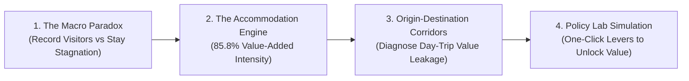

# Dashboard Creative UX & Presentation Guidelines

This skill standardizes creative UX design patterns, policy storytelling workflows, micro-interactions, and visual testing protocols for the **Malaysia Tourism Value Optimizer**.

---

## 1. Executive Storytelling Architecture

A datathon presentation interface must guide judges and policymakers through a compelling economic narrative in 4 logical stages:



1. **The Paradox (View 1 - Value Monitor)**: Highlight that domestic tourism volume has surpassed pre-pandemic peaks, but stays (ALOS) and accommodation share remain vulnerable to day-trip leakage.
2. **The Engine (View 1 & 2 - Monitor & Map)**: Prove empirically using Tourism Satellite Account (TSA) data that Accommodation Services deliver the highest Value-Added Intensity (VAI = 85.8%) across all tourism activities.
3. **The Corridor Leakage (View 3 - Value Corridors)**: Pinpoint high-volume, low-stay transit routes (e.g., Selangor/KL to Melaka/Negeri Sembilan) where value leaks away from local hosts.
4. **The Policy Simulator (View 4 - Scenario Lab)**: Provide immediate, transparent policy levers that simulate the economic dividend of turning day-trippers into overnight guests.

---

## 2. One-Click Policy Presets Pattern

To avoid requiring users to manually configure four separate sliders, the Scenario Lab must provide standardized **Intensity Presets**:

| Preset | Icon | Strategic Intent | $\Delta$ ALOS | Day-to-Overnight Conversion | Spend Uplift | VFR Regularization |
| :--- | :---: | :--- | :---: | :---: | :---: | :---: |
| **Conservative** | 🛡️ | Low-risk baseline interventions (nudge campaigns, local weekend itineraries) | `+0.2 days` | `5.0%` | `+5.0%` | `3.0%` |
| **Moderate** | ⚡ | Structured regional packaging (heritage trails, transit + hotel bundle subsidies) | `+0.4 days` | `10.0%` | `+10.0%` | `5.0%` |
| **Ambitious** | 🚀 | Major destination transformation (night economy, boutique upgrades, MICE anchor events) | `+0.6 days` | `20.0%` | `+15.0%` | `10.0%` |

### Preset Button UI Specification
- Rendered in a dedicated toolbar with active state highlight (Purple wash + deep purple border).
- Clicking a preset instantly sets all slider states while triggering smooth counter transitions.
- A **Reset** button restores the default conservative baseline.

---

## 3. Animated Counter & Micro-Interaction Engineering

Sliders and presets must feel responsive and tactile. Never jump numbers abruptly without visual feedback.

### A. Easing Interpolation (`requestAnimationFrame`)
- **Duration**: Target 350ms–450ms (optimal for human perception without sluggishness).
- **Easing Curve**: Cubic ease-out ($1 - (1 - t)^3$) for a snappy start and soft settling.
- **Font Feature**: Always set `font-variant-numeric: tabular-nums` (or Tailwind class `tabular-nums`) to prevent jitter and layout shift as digits fluctuate.

### B. Dynamic Incremental Delta Badges
Every major simulated KPI card must display an incremental delta badge comparing simulated outcome to baseline:
```tsx
<div className="inline-flex items-center gap-1 px-2 py-0.5 rounded-full text-[11px] font-bold bg-emerald-50 text-emerald-700 border border-emerald-200 tabular-nums">
  <ArrowUpRight className="w-3 h-3" />
  <span>+RM 124.5M (+14.2%)</span>
</div>
```

---

## 4. Visual Balance & Theme Invariants

### Color Tokens (PurpleX Light Theme)
- **Primary Ink**: `#251d32` (Deep Obsidian Violet)
- **Brand Accent**: `#6544b5` (Vibrant Purple)
- **Canvas / Surface**: `#f8f7f4` (Warm Editorial Linen)
- **Borders**: `#e8e3ed` (Subtle Lavender-Slate)
- **Positive Impact**: `#10b981` (Emerald) / `#059669` (Dark Emerald)
- **Warning / Capacity**: `#f59e0b` (Amber)

### Mandatory Scenario Disclaimer
Every simulation view must display the uncompromised AGENTS.md disclaimer:
> ⚠️ **Scenario estimate, not a causal forecast.**

---

## 5. Automated Visual Verification Protocols

Use automated tools to audit UX quality before presenting:
1. **Playwright / Browser Subagent**:
   - Verify viewport resizing across 1280px (laptop), 1440px (desktop), and 390px (mobile).
   - Test interaction flow: Tab switching -> Preset click -> Slider adjust -> Modal/Drawer verify.
2. **Accessibility & Contrast**:
   - Maintain minimum 4.5:1 contrast for all informational text.
   - Provide clear hover and focus rings on all interactive buttons and inputs.
