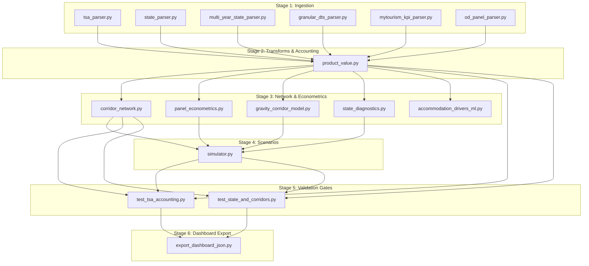

# Pipeline Orchestration & Execution Protocol

This skill guides the sequential execution, monitoring, and validation gates of the 7-stage data processing pipeline for the **Malaysia Tourism Value Optimizer**.

---

## 1. Pipeline Dependency DAG



---

## 2. Stage Contracts & Outputs

| Stage | Script(s) | Primary Tables Produced | Quality Gate / Invariant |
| :--- | :--- | :--- | :--- |
| **1. Ingest** | `src/ingestion/*.py` | `tourism_product_year` (88), `state_panel_year` (126), `origin_destination_panel` (2,048) | Zero negative values, all 16 states present |
| **2. Transforms** | `product_value.py` | `product_value_summary` (8) | Median VAI $\in [0, 1]$, VAI CV calculated |
| **3. Modeling** | `panel_econometrics.py`, `gravity_corridor_model.py` | `panel_regression_summary`, `corridor_gravity_predictions` | Clustered SEs, predictive $R^2 > 0.40$ |
| **4. Network** | `corridor_network.py`, `state_diagnostics.py` | `corridor_classification` (240), `destination_concentration` (16) | 240 interstate pairs, HHI within $[0, 10000]$ |
| **5. Scenarios** | `simulator.py` | `corridor_opportunity_gap` (240) | Room demand $\le$ destination room headroom |
| **6. Validation** | `src/validation/*.py` | Test pass report | 100% assertions pass |
| **7. Export** | `export_dashboard_json.py`| `dashboard/public/data/*.json` | No `NaN`, valid JSON schema |

---

## 3. Operational CLI Commands

Run using the virtual environment interpreter:

```bash
# Check current pipeline status and DuckDB table row counts
/home/muhammad_adib/dosm/.venv/bin/python src/pipeline.py --status

# Run individual stages
/home/muhammad_adib/dosm/.venv/bin/python src/pipeline.py --stage ingest
/home/muhammad_adib/dosm/.venv/bin/python src/pipeline.py --stage analytics
/home/muhammad_adib/dosm/.venv/bin/python src/pipeline.py --stage validate
/home/muhammad_adib/dosm/.venv/bin/python src/pipeline.py --stage export

# Run end-to-end full rebuild
/home/muhammad_adib/dosm/.venv/bin/python src/pipeline.py --stage all
```

---

## 4. Rebuild Verification Protocol

Whenever modifying ingestion parsers or analytical formulas:
1. **Status Check**: Run `pipeline.py --status` to capture baseline row counts.
2. **Execute Stage**: Re-run the modified stage.
3. **Execute Validation**: Ensure both `test_tsa_accounting.py` and `test_state_and_corridors.py` exit with 0 errors.
4. **Re-Export**: Run `pipeline.py --stage export`.
5. **Verify Web App**: Ensure `dashboard/public/data/` files are updated with fresh timestamps.
